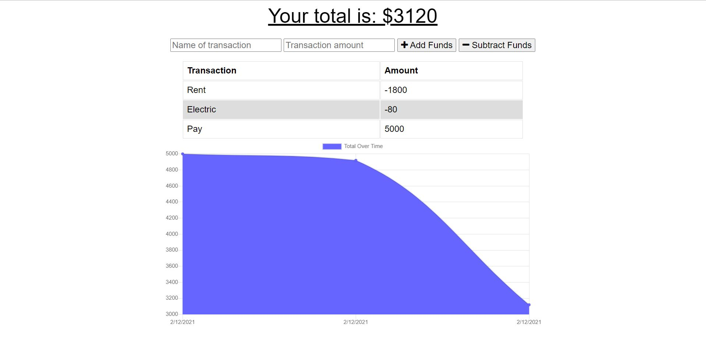

# progressiveBudget

## Description

Progressive web app that allows user to track budget. Service worker and indexDB used for offline functionality. Manifest added for app download.

## Table of Contents

- [Installation](#installation)

- [Usage](#usage)

- [Screenshot](#screenshot)

- [License](#license)

- [Links](#links)

- [Questions](#questions)

## Installation

Install necessary dependencies with npm i command.

## Usage

User inputs data into fields provide and click add or subtract funds.

## Screenshot

## License

Licensed under MIT license.

## Links

https://stormy-anchorage-67363.herokuapp.com/  
https://github.com/wyoung60/progressiveBudget

## Questions

Email wesley.young@du.edu with any questions.
